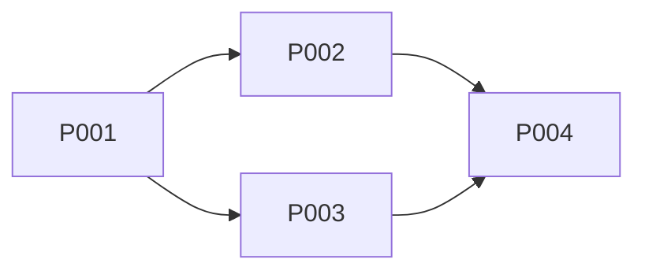

<!-- Filename: knowledge/plan-{{feature}}-{{YYYY-MM-DD}}.md -->

# PLAN: {{feature name}}

## Dependency Graph

## Steps

### P001: {{step description}}

- **Owner**: Artisan
- **Depends on**: {{none / P00X}}
- **Completion**: {{what must be true when done}}
- **Output**: {{what KDs or artifacts produced}}

### P002: {{step description}}

- **Owner**: {{Artisan}}
- **Depends on**: {{P001}}
- **Completion**: {{condition}}
- **Output**: {{artifacts}}

## Knowledge Checkpoint

This PLAN KD is the checkpoint. Commit it before any implementation starts.

## Process Friction

_This section is optional — include only if friction was encountered during work._

| ID | Issue | Severity | Status | Fixed by |
|-----|-------|----------|--------|----------|
| PF-001 | {{description of friction}} | {{low/medium/high}} | {{unresolved/resolved}} | {{agent or PR ref}} |
