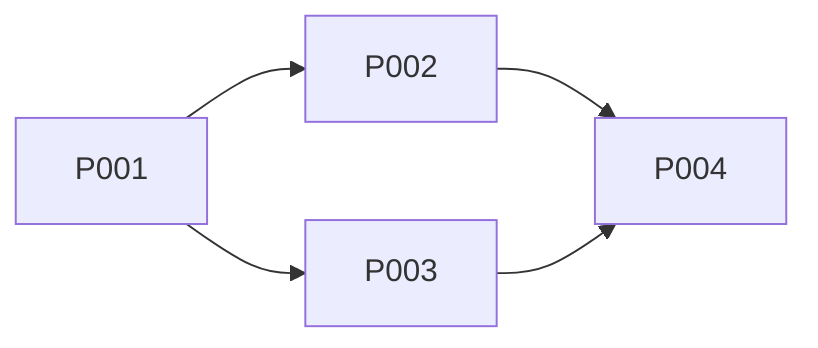

---
title: "PLAN: {{feature name}}"
version: 1.0.0
status: draft
type: plan
session_id: "{{session_id}}"
author: Pathfinder
superseded_by: null
---

<!-- Filename: knowledge/plan-{{feature}}-{{session_id}}-gen{{generation}}.md -->
<!-- GENERATION: {{generation}} is the lifecycle counter from protocol-gate state. Each lifecycle's KDs are scoped to its generation (`-genN-` after the session ID) so stale KDs from prior lifecycles are never matched. Use the generation value provided by the dispatcher. -->

# PLAN: {{feature name}}

## Dependency Graph

## Milestones

Every milestone is an independently dispatchable unit: one Artisan dispatch completes exactly one milestone. Milestone IDs must be unique within the plan and match `/^[A-Za-z0-9][A-Za-z0-9_-]*$/` (filesystem-safe — IDs appear in registry filenames and dispatch prompts). Every plan step `P###` must belong to exactly one milestone. State is tracked in the milestone registry KD `knowledge/milestones-{{feature}}-{{session_id}}-gen{{generation}}.md` written by Pathfinder at DECOMPOSE.

### M1: {{milestone description}}

- **Plan Steps**: {{P001, P002}}
- **Completion Criteria**: {{what must be true when this milestone is done}}
- **Dispatch Unit**: one Artisan dispatch completes this milestone independently

### M2: {{milestone description}}

- **Plan Steps**: {{P003}}
- **Completion Criteria**: {{condition}}
- **Dispatch Unit**: one Artisan dispatch completes this milestone independently

## Steps

### P001: {{step description}}

- **Owner**: Artisan
- **Depends on**: {{none / P00X}}
- **Completion**: {{what must be true when done}}
- **Output**: {{what KDs or artifacts produced}}

### P002: {{step description}}

- **Owner**: {{Artisan}}
- **Depends on**: {{P001}}
- **Completion**: {{condition}}
- **Output**: {{artifacts}}

## Process Friction

_This section is optional — include it when friction was encountered during work._

| ID     | Issue                       | Severity            | Status                  | Fixed by            |
| ------ | --------------------------- | ------------------- | ----------------------- | ------------------- |
| PF-001 | {{description of friction}} | {{low/medium/high}} | {{unresolved/resolved}} | {{agent or PR ref}} |
