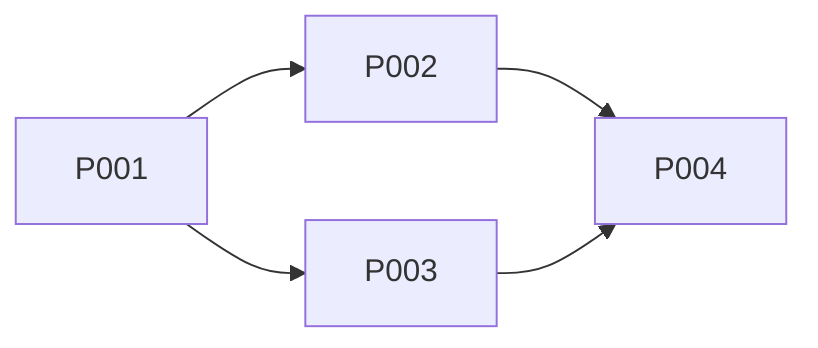

---
title: "PLAN: {{feature name}}"
version: 1.0.0
status: draft
type: plan
session_id: "{{session_id}}"
author: Pathfinder
superseded_by: null
---

<!-- Filename: knowledge/plan-{{feature}}-{{session_id}}-gen{{generation}}.md -->
<!-- GENERATION: {{generation}} is the lifecycle counter from protocol-gate state. Each lifecycle's KDs are scoped to its generation (`-genN-` after the session ID) so stale KDs from prior lifecycles are never matched. Use the generation value provided by the dispatcher. -->

# PLAN: {{feature name}}

## Dependency Graph

## Steps

### P001: {{step description}}

- **Owner**: Artisan
- **Depends on**: {{none / P00X}}
- **Completion**: {{what must be true when done}}
- **Output**: {{what KDs or artifacts produced}}

### P002: {{step description}}

- **Owner**: {{Artisan}}
- **Depends on**: {{P001}}
- **Completion**: {{condition}}
- **Output**: {{artifacts}}

## Knowledge Checkpoint

This PLAN KD is the checkpoint. Commit it before any implementation starts.

## Process Friction

_This section is optional — include only if friction was encountered during work._

| ID     | Issue                       | Severity            | Status                  | Fixed by            |
| ------ | --------------------------- | ------------------- | ----------------------- | ------------------- |
| PF-001 | {{description of friction}} | {{low/medium/high}} | {{unresolved/resolved}} | {{agent or PR ref}} |
